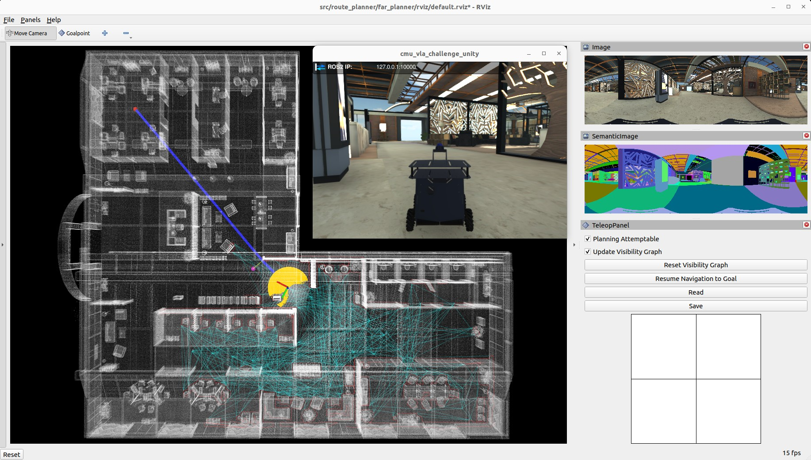
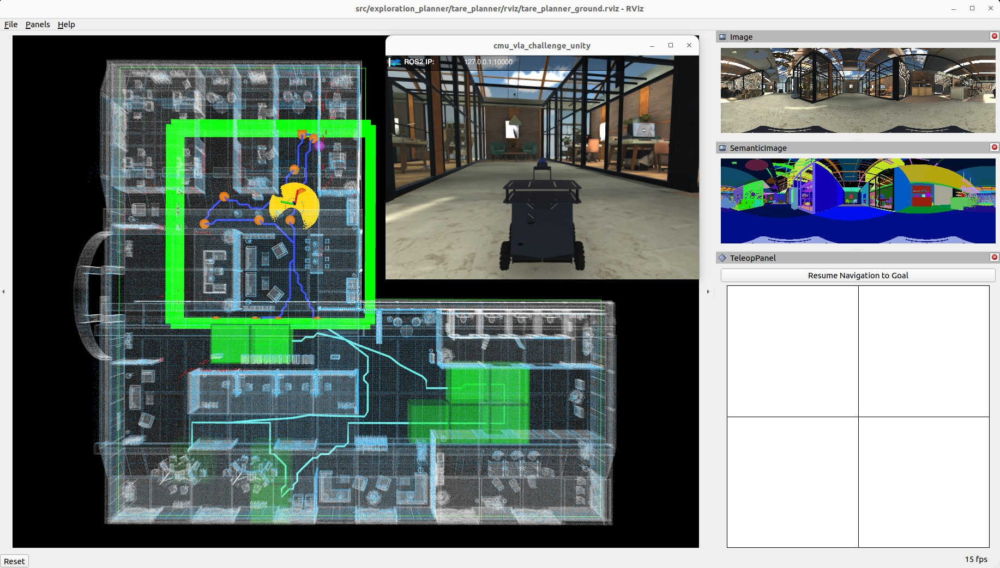

The autonomy stack contains a SLAM module, a route planner, an exploration planner, and a base autonomy system, 
where the base autonomy system further includes fundamental navigation modules for terrain traversability analysis, 
collision avoidance, and waypoint following. 
The system overall is capable of taking a goal point and navigating the embodiment (vehicle, Go2, G1) autonomously to the goal point 
as well as exploring an environment and building a map along the way. 
Alternatively, the system allows users to use a joystick controller to guide the navigation while the system itself is in charge of 
collision avoidance. We provide a simulation setup together with the real robot setup for users to take advantage of the system in various use cases. 
The full autonomy stack is open-sourced.

## Simulation Setup

### Base Autonomy

The system is integrated with [Unity](https://unity.com) environment models for simulation. The repository has been tested in Ubuntu 24.04 with [ROS2 Jazzy](https://docs.ros.org/en/jazzy/Installation.html). 
After installing ROS2 Jazzy, add 'source /opt/ros/jazzy/setup.bash' to the '~/.bashrc' file and `source ~/.bashrc` in the terminal to engage the installation.
```
echo "source /opt/ros/jazzy/setup.bash" >> ~/.bashrc
source ~/.bashrc
```
Install dependencies with the command lines below.
```
sudo apt update
sudo apt install ros-jazzy-desktop-full ros-jazzy-pcl-ros libpcl-dev git
```
In a terminal, go to the folder, checkout the 'go2_slow_fast_webrtc' or "unitree_g1" branch, and compile. 
Note that this skips the SLAM module and Mid-360 lidar driver. The two packages are not needed for simulation.
To avoid build instability on the robot, the commands below use sequential compilation.
```
git checkout go2_slow_fast_webrtc
colcon build --executor sequential --parallel-workers 1 --symlink-install --cmake-args -DCMAKE_BUILD_TYPE=Release --packages-skip arise_slam_mid360 arise_slam_mid360_msgs livox_ros_driver2
```
Download a [Unity environment model for the Mecanum wheel platform](https://drive.google.com/drive/folders/1G1JYkccvoSlxyySuTlPfvmrWoJUO8oSs?usp=sharing) and 
unzip the files to the 'src/base_autonomy/vehicle_simulator/mesh/unity' folder. 
The environment model files should look like below. For computers without a powerful GPU, please try the 'without_360_camera' version for a higher rendering rate.

mesh/<br>
&nbsp;&nbsp;&nbsp;&nbsp;unity/<br>
&nbsp;&nbsp;&nbsp;&nbsp;&nbsp;&nbsp;&nbsp;&nbsp;environment/<br>
&nbsp;&nbsp;&nbsp;&nbsp;&nbsp;&nbsp;&nbsp;&nbsp;&nbsp;&nbsp;&nbsp;&nbsp;Model_Data/ (multiple files in the folder)<br>
&nbsp;&nbsp;&nbsp;&nbsp;&nbsp;&nbsp;&nbsp;&nbsp;&nbsp;&nbsp;&nbsp;&nbsp;Model.x86_64<br>
&nbsp;&nbsp;&nbsp;&nbsp;&nbsp;&nbsp;&nbsp;&nbsp;&nbsp;&nbsp;&nbsp;&nbsp;UnityPlayer.so<br>
&nbsp;&nbsp;&nbsp;&nbsp;&nbsp;&nbsp;&nbsp;&nbsp;&nbsp;&nbsp;&nbsp;&nbsp;AssetList.csv (generated at runtime)<br>
&nbsp;&nbsp;&nbsp;&nbsp;&nbsp;&nbsp;&nbsp;&nbsp;&nbsp;&nbsp;&nbsp;&nbsp;Dimensions.csv<br>
&nbsp;&nbsp;&nbsp;&nbsp;&nbsp;&nbsp;&nbsp;&nbsp;&nbsp;&nbsp;&nbsp;&nbsp;Categories.csv<br>
&nbsp;&nbsp;&nbsp;&nbsp;&nbsp;&nbsp;&nbsp;&nbsp;map.ply<br>
&nbsp;&nbsp;&nbsp;&nbsp;&nbsp;&nbsp;&nbsp;&nbsp;object_list.txt<br>
&nbsp;&nbsp;&nbsp;&nbsp;&nbsp;&nbsp;&nbsp;&nbsp;traversable_area.ply<br>
&nbsp;&nbsp;&nbsp;&nbsp;&nbsp;&nbsp;&nbsp;&nbsp;map.jpg<br>
&nbsp;&nbsp;&nbsp;&nbsp;&nbsp;&nbsp;&nbsp;&nbsp;render.jpg<br>

In a terminal, go to the repository folder and launch the system.
```
./system_simulation.sh
```
After seeing data showing up in RVIZ, users can use the 'Waypoint' button to set waypoints and navigate the vehicle around. 
Note that the waypoints are meant to be relatively close to the vehicle. 
Setting the waypoint too far can cause the vehicle to get stuck at a dead end. 
Users can also operate in *smart joystick mode* where the vehicle tries to follow joystick commands and also avoid collisions. 
To do this, users can use the control panel in RVIZ or a PS3/4 or Xbox controller with a USB or Bluetooth interface. 
When using the joystick controller, users can also operate in *manual mode* without any collision avoidance. 
Detailed information about the operations in the three modes is below.

<p align="center">
  <br>
  <em>Base autonomy (smart joystick, waypoint, and manual modes)</em>
</p>

- *Smart joystick mode (default)*: The vehicle tries to follow joystick commands and also avoid collisions. Use the control panel in RVIZ or the right joystick on the controller to set the speed and yaw rate. If the system is in another mode, doing so will switch the system to *smart joystick mode*.

- *Waypoint mode*: The vehicle tries to follow waypoints and also avoid collisions. Use the 'Waypoint' button in RVIZ to set a waypoint by first clicking the button and then clicking where the waypoint is to be set around the vehicle. If the system is in another mode, clicking the 'Resume Navigation to Goal' button in RVIZ switches the system to *waypoint mode*. Or, users can hold the 'waypoint-mode' button on the joystick controller and use the right joystick to set the speed. If only holding the 'waypoint-mode' button, the system will use the speed sent in ROS messages.

- *Manual mode*: The vehicle tries to follow joystick commands without any collision avoidance. Pressing the 'manual-mode' button on the joystick controller switches the system to *manual mode*. Then, use the right joystick to set the forward and lateral speed and the left joystick to set the yaw rate, in the Mode 2 convention.

<p align="center">
  
  &nbsp;&nbsp;&nbsp;&nbsp;
  
</p>

Alternatively, users can run a ROS node to send a series of waypoints. 
In another terminal, go to the folder and source the ROS workspace, then run the ROS node with the command lines below. 
The ROS node sends navigation boundary and speed as well. Click the 'Resume Navigation to Goal' button in RVIZ, 
and the vehicle will navigate inside the boundary following the waypoints. 
More information about the base autonomy system is available on the [Autonomous Exploration Development Environment](https://www.cmu-exploration.com) website.
```
source install/setup.sh
ros2 launch waypoint_example waypoint_example.launch
```

### Route Planner

The route planner conducts planning in the global environment and guides the vehicle to navigate to a goal point. To launch the system with route planner, use the command line below.
```
./system_simulation_with_route_planner.sh
```
Users can send a goal point with the 'Goalpoint' button in RVIZ. The vehicle will navigate to the goal and build a visibility graph (in cyan) along the way. Areas covered by the visibility graph become free space. When navigating in free space, the planner uses the built visibility graph, and when navigating in unknown space, the planner attempts to discover a way to the goal. By pressing the 'Reset Visibility Graph' button, the planner will reinitialize the visibility graph. By unchecking the 'Planning Attemptable' checkbox, the planner will first try to find a path through the free space. The path will show in green. If such a path does not exist, the planner will consider unknown space together. The path will show in blue. By unchecking the 'Update Visibility Graph' checkbox, the planner will stop updating the visibility graph. When navigating with the route planner, the base autonomy system operates in *waypoint mode*. Users can click in the black box on the control panel to switch to *smart joystick mode*, or press the buttons on a joystick controller to switch to *smart joystick mode* or *manual mode*. To resume route planner navigation, click the 'Resume Navigation to Goal' button in RVIZ or use the 'Goalpoint' button to set a new goalpoint. More information about the route planner is available on the [FAR Planner website](https://github.com/MichaelFYang/far_planner).

<p align="center">
  <br>
  <em>Base autonomy with route planner</em>
</p>

### Exploration Planner

The exploration planner conducts planning in the global environment and guides the vehicle to cover the environment. To launch the system with exploration planner, use the command line below.
```
./system_simulation_with_exploration_planner.sh
```
Click the 'Resume Navigation to Goal' button in RVIZ to start the exploration. Users can adjust the navigation boundary to constrain the areas to explore by updating the boundary polygon in the 'src/exploration_planner/tare_planner/data/boundary.ply' file. When navigating with the exploration planner, the base autonomy system operates in *waypoint mode*. Users can click in the black box on the control panel to switch to *smart joystick mode*, or press the buttons on a joystick controller to switch to *smart joystick mode* or *manual mode*. To resume exploration, click the 'Resume Navigation to Goal' button in RVIZ. Note that previously, due to usage of [OR-Tools](https://developers.google.com/optimization) library, the exploration_planner only supports AMD64 architecture. A recent upgrade to the library made it compatible with both AMD64 and ARM computers. On ARM computers, please download the corresponding [binary release](https://github.com/google/or-tools/releases) for the target platform, for example, [or-tools_arm64_debian-11_cpp_v9.8.3296.tar.gz](https://github.com/google/or-tools/releases/download/v9.8/or-tools_arm64_debian-11_cpp_v9.8.3296.tar.gz), extract it, and replace the 'include' and 'lib' folders under 'src/exploration_planner/tare_planner/or-tools'. More information about the exploration planner is available on the [TARE Planner website](https://github.com/caochao39/tare_planner).

<p align="center">
  <br>
  <em>Base autonomy with exploration planner</em>
</p>

## Real-robot Setup

### System Setup

On the processing computer, install [Ubuntu 24.04](https://releases.ubuntu.com/noble), connect the computer to Internet, and install [ROS2 Jazzy](https://docs.ros.org/en/jazzy/Installation.html).
After installation of ROS2 Jazzy, add `source /opt/ros/jazzy/setup.bash` to the `~/.bashrc` file and `source ~/.bashrc` in the terminal to engage the installation, 
or use the command lines below.
Add user to the dialout group by `sudo adduser 'username' dialout`.
Then, reboot the computer.
Optionally, configure BIOS and set the computer to automatically boot when power is supplied

```
echo "source /opt/ros/jazzy/setup.bash" >> ~/.bashrc
source ~/.bashrc
sudo adduser 'username' dialout
sudo reboot now
```

#### 1) All Dependencies

Please install dependencies with the command lines below before proceeding to the next setup steps.

```
sudo apt update
sudo apt install ros-jazzy-desktop-full ros-jazzy-pcl-ros libpcl-dev git cmake libgoogle-glog-dev libgflags-dev libatlas-base-dev libeigen3-dev libsuitesparse-dev
```

#### 2) Mid-360 Lidar
More information about [‘Livox-SDK2’ can be found here](https://github.com/Livox-SDK/Livox-SDK2).

```
cd src/utilities/livox_ros_driver2/Livox-SDK2
mkdir build && cd build
cmake ..
make && sudo make install
```
Compile the Mid-360 lidar driver. 
Note that the driver needs to be configured specifically to the lidar. 
In the `src/utilities/livox_ros_driver2/config/MID360_config.json` file, 
under the `lidar_configs` settings, 
set the IP to `192.168.1.1xx`, where xx are the last two digits of the lidar serial number (you can find it on a sticker under a QR code on the lidar).

```
colcon build --executor sequential --parallel-workers 1 --symlink-install --cmake-args -DCMAKE_BUILD_TYPE=Release --packages-select livox_ros_driver2
```
Connect the lidar to the Ethernet port on the processing computer and power it on. 
1. Open Network Settings in Ubuntu
2. Find your Ethernet connection to the MID360
3. Click the gear icon to edit settings
4. Go to IPv4 tab
5. Change Method from "Automatic (DHCP)" to "Manual"
6. Add the following settings:
   - **Address**: 192.168.1.5
   - **Netmask**: 255.255.255.0
   - **Gateway**: 192.168.1.1
   

The IP is specified in the same json file. 
At this point, you should be able to pin the lidar by `ping 192.168.1.1xx`.
Then, launch the driver with RVIZ to view the scan data only. 
More information about the [Mid-360 lidar driver is available here](https://github.com/Livox-SDK/livox_ros_driver2).

```
source install/setup.sh
ros2 launch livox_ros_driver2 rviz_MID360_launch.py
```

#### 3) SLAM Module

More information about [Sophus is available here](https://github.com/strasdat/Sophus)

```
cd src/slam/dependency/Sophus
mkdir build && cd build
cmake .. -DBUILD_TESTS=OFF
make && sudo make install
```

More information about [Ceres Solver is available here](http://ceres-solver.org).

```
cd src/slam/dependency/ceres-solver
mkdir build && cd build
cmake ..
make && sudo make install
```

More information about [GTSAM is available here](https://gtsam.org).

```
cd src/slam/dependency/gtsam
mkdir build && cd build
cmake .. -DGTSAM_USE_SYSTEM_EIGEN=ON -DGTSAM_BUILD_WITH_MARCH_NATIVE=OFF
make && sudo make install
sudo /sbin/ldconfig -v
```

Now, compile the SLAM module. Note that the Mid-360 lidar driver is a dependency of the SLAM module. Please make sure it is already compiled.

```
colcon build --executor sequential --parallel-workers 1 --symlink-install --cmake-args -DCMAKE_BUILD_TYPE=Release --packages-select arise_slam_mid360 arise_slam_mid360_msgs
```

#### 4) Motor Controller

Connect the motor controller to the processing computer via a USB cable. 
Determine the serial device on the processing computer. 
You may list all the entries by `ls /dev`. 
The device is likely registered as '/dev/ttyACM0' or '/dev/ttyACM1'... 
In the 'src/base_autonomy/local_planner/launch/local_planner.launch' and 'src/utilities/teleop_joy_controller/launch/teleop_joy_controller.launch' files, 
update the '/dev/ttyACM0' entry and compile the serial driver.

```
cd src/base_autonomy/local_planner/launch/local_planner.launch

cd src/utilities/teleop_joy_controller/launch/teleop_joy_controller.launch

colcon build --executor sequential --parallel-workers 1 --symlink-install --cmake-args -DCMAKE_BUILD_TYPE=Release --packages-select serial teleop_joy_controller

```

Take the joystick controller and plug the USB dongle into the processing computer. Some joystick controllers have different modes. 
Make sure the joystick controller is in the right mode (usually the factory default mode) and is powered on. 
For this particular joystick controller, the two LEDs on top of the center button should be lit to indicate the right mode. 
Holding the center button for a few seconds changes the mode. Now, power on the vehicle. 
Use the command lines below to launch the teleoperation test. 
Users can use the right joystick to set the forward and lateral speed and the left joystick to set the yaw rate. Be cautious and drive slowly at the beginning.

```
source install/setup.sh
ros2 launch teleop_joy_controller teleop_joy_controller.launch
```

#### 5) Full Repository

After completion of the above setup steps, you can compile the full repository.

```
colcon build --executor sequential --parallel-workers 1 --symlink-install --cmake-args -DCMAKE_BUILD_TYPE=Release
```

### System Usage

The system supports different robot configurations. Set the `ROBOT_CONFIG_PATH` environment variable to specify which robot configuration to use:
custom robot configs in `src/base_autonomy/local_planner/config/`

```
export ROBOT_CONFIG_PATH="unitree/unitree_g1" # or "unitree_go2_slow", "unitree_go2_fast"
source install/setup.sh
```

For the current recommended G1 setup in this repository, the tasks below should be completed before the first real-robot run:

1. Install Ubuntu 24.04, ROS 2 Jazzy, and system dependencies used by the autonomy stack.
2. Install and configure the Mid-360 lidar driver:
   - build `Livox-SDK2`
   - configure `src/utilities/livox_ros_driver2/config/MID360_config.json`
   - build `livox_ros_driver2`
3. Install the SLAM dependencies and build the SLAM packages:
   - `Sophus`
   - `Ceres Solver`
   - `GTSAM`
   - `arise_slam_mid360`
   - `arise_slam_mid360_msgs`
4. Install the Unitree WebRTC control dependency used by the default G1 control path:
   - if `conda` is active, run `conda deactivate`
   - create `~/unitree_venv` with `/usr/bin/python3.12 -m venv ~/unitree_venv`
   - activate `~/unitree_venv`
   - install `unitree_webrtc_connect`
   - make sure `portaudio19-dev` is installed
5. Build the full repository after the above dependencies are ready.
6. Before each real-robot session:
   - if `conda` is active, run `conda deactivate`
   - activate the Python virtual environment if `unitree_webrtc_ros` is used
   - source ROS 2 and the workspace
   - set `ROBOT_CONFIG_PATH=unitree/unitree_g1`
   - verify robot IP / connection method
   - verify Mid-360 connectivity

The current default G1 control path in this repository is:

`/cmd_vel` -> `unitree_webrtc_ros/unitree_control` -> Unitree WebRTC transport

If the WebRTC transport cannot complete the local handshake on your G1, you can keep this repository's SLAM and planning stack and swap only the control backend:

`/cmd_vel` -> `g1_controller/cmd_vel_to_g1` -> `g1_loco_client` -> G1

The dedicated launch entry for that fallback is:

```bash
./system_real_robot_g1_bridge.sh --no-rviz
```

For the `g1_controller` / `g1_loco_client` path, keep the control interface on `enp108s0`. Do not use `Meta` for this bridge unless you have independently verified that your Unitree SDK traffic is routed there.

Common bridge-specific arguments:

```bash
./system_real_robot_g1_bridge.sh \
  network_interface:=enp108s0 \
  g1_loco_client_path:=/home/mhw/robot_g1/unitree_sdk2/build/bin/g1_loco_client \
  unitree_sdk_lib_path:=/home/mhw/robot_g1/unitree_sdk2/thirdparty/lib/x86_64
```

This means the old serial motor-controller setup in the original repository is not the primary path for G1 anymore. For the default G1 workflow, prioritize:

- Mid-360 driver setup
- SLAM dependency setup
- `unitree_webrtc_connect` installation

and treat the old serial motor-controller instructions as legacy setup notes rather than the default G1 requirement.

Useful references in this repository:

- [G1_DEPLOYMENT_GUIDE.md](G1_DEPLOYMENT_GUIDE.md)
- [src/unitree_webrtc_ros/README.md](src/unitree_webrtc_ros/README.md)

Power on the vehicle. In a terminal, go to the repository folder and use the command line below to launch the system. This launches the SLAM module and the base autonomy system together with the vehicle motor controller drivers.

In this repository revision, the real-robot launch files default to `robot_config:=unitree/unitree_g1` and `autonomyMode:=true` for the G1 workflow. You can still override these launch arguments explicitly if needed.

```
# Go2_slow
./system_real_robot.sh robot_ip:=192.168.12.1 connection_method:=LocalAP control_mode:=wireless_controller

# Go2_fast
./system_real_robot.sh robot_ip:=192.168.12.1 connection_method:=LocalAP control_mode:=sport_cmd

# G1 (make sure the G1 robot is in low-speed mode and advanced motion control is enabled (arm is included))
./system_real_robot.sh robot_ip:=192.168.1.120 connection_method:=LocalSTA control_mode:=wireless_controller

```

#### Plan B: Legacy G1 `cmd_vel` Bridge

The default G1 control path in this repository is:

`/cmd_vel` -> `unitree_webrtc_ros/unitree_control` -> Unitree WebRTC transport

If the WebRTC control path is unavailable or unstable on a target deployment, a fallback option is to use the legacy ROS 2 `cmd_vel` bridge from the sibling workspace package:

`/home/mhw/unitree_project/g1_ros_package/controller/g1_controller`

That bridge converts `geometry_msgs/msg/TwistStamped` commands on `/cmd_vel` into calls to `g1_loco_client`.

Use Plan B only when needed, and do not run it together with `unitree_webrtc_ros/unitree_control`, otherwise two different backends may consume the same `/cmd_vel` stream and send duplicate motion commands to the robot.

Build and launch the fallback bridge with:

```bash
cd /home/mhw/unitree_project/g1_ros_package
source /opt/ros/jazzy/setup.bash
colcon build --executor sequential --parallel-workers 1 --symlink-install --packages-select g1_controller
source install/setup.bash
ros2 launch g1_controller cmd_vel_to_g1.launch.py
```

When using Plan B, make sure your autonomy stack still publishes `/cmd_vel`, but disable the default `unitree_webrtc_ros/unitree_control` backend from the real-robot launch sequence.

Kill all ros related processes before launching the system if needed.
```
sudo pkill -9 -f '/opt/ros/.*\/lib\/|\/install\/.*\/lib\/|_ros2_daemon|^[[:space:]]*ros2$'
```

## Credits

Development of the autonomy stack is led by [Ji Zhang's](https://frc.ri.cmu.edu/~zhangji) group at Carnegie Mellon University.

[gtsam](https://gtsam.org) [Ceres Solver](http://ceres-solver.org), [Sophus](http://github.com/strasdat/Sophus.git), [domain_bridge](https://github.com/ros2/domain_bridge), [livox_ros_driver2](https://github.com/Livox-SDK/livox_ros_driver2), [Livox-SDK2](https://github.com/Livox-SDK/Livox-SDK2), [ROS-TCP-Endpoint](https://github.com/Unity-Technologies/ROS-TCP-Endpoint), and [serial](https://github.com/wjwwood/serial) packages are from open-source releases.

## Relevant Links

The SLAM module is an upgraded implementation of [LOAM](https://github.com/cuitaixiang/LOAM_NOTED).

The base autonomy system is based on [Autonomous Exploration Development Environment](https://www.cmu-exploration.com).

The route planner is based on [FAR Planner](https://github.com/MichaelFYang/far_planner).

The exploration planner is based on [TARE Planner](https://github.com/caochao39/tare_planner).
