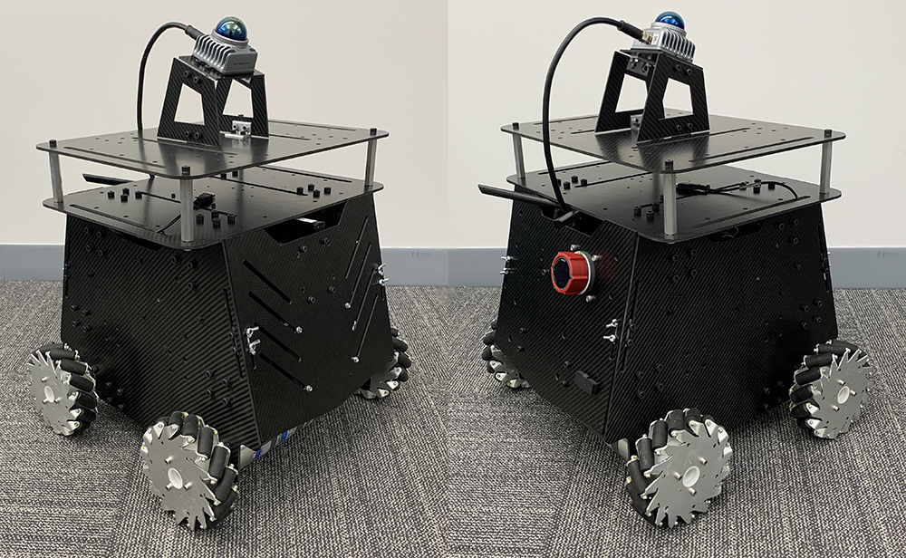

# End2end ObjectNav Physical Experiment

本项目是一个基于 ROS2 Jazzy 的端到端导航与物理实验工作空间，核心能力包括：

- `Livox Mid-360` 激光雷达驱动
- `arise_slam_mid360` 激光 SLAM
- 基础自主导航链路：地形分析、碰撞规避、路径跟踪
- 全局路线规划与自主探索规划
- Unity 场景仿真与真实机器人两套运行模式

当前仓库是在原始全向轮平台自治栈基础上做的本地改造版本，已经切换到 `.launch.py` 启动方式，并与本仓库中的 `g1_ros_package` 配合使用。需要注意的是：

- 本目录 `End2end-ObjectNav-Physical-Experiment` 主要负责感知、建图、规划和 RViz 操作链路
- `Unitree G1` 的 `cmd_vel` 桥接节点位于兄弟目录 `../g1_ros_package/controller/g1_controller`
- 目前主启动脚本还没有直接把 `g1_controller` 编进来，若要驱动 G1，需要额外启动桥接节点

点击查看：

- 产品主页：https://www.tarerobotics.com
- 上游教程：https://tarerobotics.readthedocs.io

<p align="center">
  
</p>

## 目录结构

```text
End2end-ObjectNav-Physical-Experiment/
├── system_*.sh                                  # 仿真/实机/规划模式一键启动脚本
├── src/
│   ├── base_autonomy/                           # 基础自主导航：局部规划、地形分析、仿真器、可视化
│   ├── exploration_planner/tare_planner/       # 探索规划
│   ├── route_planner/                           # 全局路线规划
│   ├── slam/arise_slam_mid360/                  # Mid-360 对应的 SLAM 模块
│   └── utilities/livox_ros_driver2/             # Livox Mid-360 驱动
└── img/                                         # README 展示图片
```

相关的 G1 控制桥接包位于：

```text
../g1_ros_package/controller/g1_controller
```

## 环境要求

- Ubuntu 24.04
- ROS2 Jazzy
- `colcon`
- `PCL`
- `Eigen`
- `Ceres Solver`
- `GTSAM`
- `Livox-SDK2`

建议先在 `~/.bashrc` 中加入：

```bash
echo "source /opt/ros/jazzy/setup.bash" >> ~/.bashrc
source ~/.bashrc
```

基础依赖安装：

```bash
sudo apt update
sudo apt install ros-jazzy-desktop-full ros-jazzy-pcl-ros libpcl-dev git cmake \
  libgoogle-glog-dev libgflags-dev libatlas-base-dev libeigen3-dev libsuitesparse-dev
```

如果实机需要访问串口设备，还需要把用户加入 `dialout` 组：

```bash
sudo adduser "$USER" dialout
sudo reboot
```

## 编译说明

以下命令默认在本目录执行：

```bash
cd End2end-ObjectNav-Physical-Experiment
```

### 1. 仿真模式编译

仿真不依赖 `Mid-360` 驱动和 `SLAM`，可以只编译导航与仿真相关包：

```bash
colcon build --symlink-install --cmake-args -DCMAKE_BUILD_TYPE=Release \
  --packages-skip arise_slam_mid360 arise_slam_mid360_msgs livox_ros_driver2
```

### 2. Mid-360 驱动编译

先安装 `Livox-SDK2`：

```bash
cd src/utilities/livox_ros_driver2/Livox-SDK2
mkdir -p build
cd build
cmake ..
make -j"$(nproc)"
sudo make install
```

然后配置雷达 IP：

- 配置文件：[MID360_config.json](/home/mhw/unitree_project/End2end-ObjectNav-Physical-Experiment/src/utilities/livox_ros_driver2/config/MID360_config.json)
- `lidar_configs` 中的 IP 一般设置为 `192.168.1.1xx`
- `xx` 通常对应雷达序列号后两位

编译驱动：

```bash
cd End2end-ObjectNav-Physical-Experiment
colcon build --symlink-install --cmake-args -DCMAKE_BUILD_TYPE=Release \
  --packages-select livox_ros_driver2
```

### 3. SLAM 编译

`arise_slam_mid360` 依赖本地编译的 `Sophus`、`Ceres Solver` 和 `GTSAM`。

安装 `Sophus`：

```bash
cd src/slam/dependency/Sophus
mkdir -p build
cd build
cmake .. -DBUILD_TESTS=OFF
make -j"$(nproc)"
sudo make install
```

安装 `Ceres Solver`：

```bash
cd ../../ceres-solver
mkdir -p build
cd build
cmake ..
make -j"$(nproc)"
sudo make install
```

安装 `GTSAM`：

```bash
cd ../../gtsam
mkdir -p build
cd build
cmake .. -DGTSAM_USE_SYSTEM_EIGEN=ON -DGTSAM_BUILD_WITH_MARCH_NATIVE=OFF
make -j"$(nproc)"
sudo make install
sudo /sbin/ldconfig -v
```

编译 SLAM：

```bash
cd End2end-ObjectNav-Physical-Experiment
colcon build --symlink-install --cmake-args -DCMAKE_BUILD_TYPE=Release \
  --packages-select arise_slam_mid360 arise_slam_mid360_msgs
```

说明：

- 当前 [arize_slam.launch.py](/home/mhw/unitree_project/End2end-ObjectNav-Physical-Experiment/src/slam/arise_slam_mid360/launch/arize_slam.launch.py) 会从工作空间内拼接 `GTSAM` 的库路径
- 因此 `GTSAM` 需要至少完成一次本地编译

### 4. 全量编译

如果依赖都已就绪，可以直接全量编译：

```bash
cd End2end-ObjectNav-Physical-Experiment
colcon build --symlink-install --cmake-args -DCMAKE_BUILD_TYPE=Release
```

## 运行方式

### 仿真模式

需要先准备 Unity 环境模型，并放到：

```text
src/base_autonomy/vehicle_simulator/mesh/unity/environment/
```

典型文件结构如下：

```text
mesh/
└── unity/
    ├── environment/
    │   ├── Model_Data/
    │   ├── Model.x86_64
    │   ├── UnityPlayer.so
    │   ├── AssetList.csv
    │   ├── Dimensions.csv
    │   └── Categories.csv
    ├── map.ply
    ├── object_list.txt
    ├── traversable_area.ply
    ├── map.jpg
    └── render.jpg
```

启动基础仿真：

```bash
./system_simulation.sh
```

启动带路线规划的仿真：

```bash
./system_simulation_with_route_planner.sh
```

启动带探索规划的仿真：

```bash
./system_simulation_with_exploration_planner.sh
```

### 真实机器人模式

基础实机启动：

```bash
./system_real_robot.sh
```

带路线规划：

```bash
./system_real_robot_with_route_planner.sh
```

带探索规划：

```bash
./system_real_robot_with_exploration_planner.sh
```

当前 [system_real_robot.sh](/home/mhw/unitree_project/End2end-ObjectNav-Physical-Experiment/system_real_robot.sh) 实际会启动：

- `vehicle_simulator/system_real_robot.launch.py`
- `livox_ros_driver2`
- `arise_slam_mid360`
- `local_planner`
- `terrain_analysis`
- `sensor_scan_generation`
- RViz

对应主启动文件见：

- [system_real_robot.launch.py](/home/mhw/unitree_project/End2end-ObjectNav-Physical-Experiment/src/base_autonomy/vehicle_simulator/launch/system_real_robot.launch.py)
- [system_simulation.launch.py](/home/mhw/unitree_project/End2end-ObjectNav-Physical-Experiment/src/base_autonomy/vehicle_simulator/launch/system_simulation.launch.py)

## RViz 操作说明

基础模式支持以下三种操作逻辑：

- 智能遥控模式：系统跟随摇杆速度，同时进行碰撞规避
- 航点模式：在 RViz 中发送近距离航点，系统自动跟踪并避障
- 手动模式：直接按摇杆速度控制，不启用碰撞规避

常见操作：

- `Waypoint`：设置局部航点
- `Resume Navigation to Goal`：恢复自动导航
- `Goalpoint`：发送全局目标点
- `Reset Visibility Graph`：重建路线规划可见图

<p align="center">
  <br>
  <em>基础自主导航界面</em>
</p>

<p align="center">
  <br>
  <em>路线规划模式</em>
</p>

<p align="center">
  <br>
  <em>探索规划模式</em>
</p>

## 关键配置文件

### Mid-360

- [MID360_config.json](/home/mhw/unitree_project/End2end-ObjectNav-Physical-Experiment/src/utilities/livox_ros_driver2/config/MID360_config.json)
  - 配置雷达 IP、主机 IP 和端口

### SLAM

- [arize_slam.launch.py](/home/mhw/unitree_project/End2end-ObjectNav-Physical-Experiment/src/slam/arise_slam_mid360/launch/arize_slam.launch.py)
  - 配置 `config_file`、标定文件、里程计话题和库路径

### 串口底盘控制

- [local_planner.launch](/home/mhw/unitree_project/End2end-ObjectNav-Physical-Experiment/src/base_autonomy/local_planner/launch/local_planner.launch)
- [teleop_joy_controller.launch](/home/mhw/unitree_project/End2end-ObjectNav-Physical-Experiment/src/utilities/teleop_joy_controller/launch/teleop_joy_controller.launch)

如果你用的是串口底盘，而不是 G1，需要检查：

- 串口设备名是否正确，例如 `/dev/ttyACM0`
- 手柄设备是否在 `/dev/input/js0`

## G1 接入说明

本目录并不直接负责 `Unitree G1` 的底层动作下发。当前仓库中的 G1 适配放在：

- [g1_controller README](/home/mhw/unitree_project/g1_ros_package/controller/g1_controller/README.md)

作用：

- 订阅 ROS2 标准 `/cmd_vel`
- 将速度指令转发为 `g1_loco_client` 调用
- 让 Nav2 或本仓库输出的速度控制命令可以驱动 G1

编译 `g1_controller`：

```bash
cd ../g1_ros_package
source /opt/ros/jazzy/setup.bash
colcon build --symlink-install --packages-select g1_controller
source install/setup.bash
```

启动桥接节点：

```bash
ros2 launch g1_controller cmd_vel_to_g1.launch.py
```

可选参数示例：

```bash
ros2 launch g1_controller cmd_vel_to_g1.launch.py \
  network_interface:=enp108s0 \
  g1_loco_client_path:=/home/mhw/robot_g1/unitree_sdk2/build/bin/g1_loco_client \
  unitree_sdk_lib_path:=/home/mhw/robot_g1/unitree_sdk2/thirdparty/lib/x86_64 \
  command_timeout:=0.1
```

说明：

- 当前 `system_real_robot.sh` 并不会自动启动 `g1_controller`
- 如果你要把本导航链路接到 G1，本桥接节点需要单独开
- 启动前请确认 `g1_loco_client` 可执行、网络接口名称正确、SDK 动态库路径有效

## 常见问题

### 1. 启动后没有雷达数据

- 检查 `MID360_config.json` 中的雷达 IP 和主机 IP
- 确认网卡地址已配置到与雷达同一网段
- 使用 `ping 192.168.1.1xx` 测试通信

### 2. SLAM 启动时报库找不到

- 确认 `Sophus`、`Ceres Solver`、`GTSAM` 已成功编译
- 确认 `src/slam/dependency/gtsam/build/gtsam` 目录存在

### 3. RViz 能打开但车不动

- 如果是串口底盘，检查串口号和手柄设备
- 如果是 G1，确认你已经额外启动 `g1_controller`
- 检查 `/cmd_vel` 是否有输出

### 4. 仿真打不开 Unity

- 检查 `mesh/unity/environment/Model.x86_64` 是否存在
- 没有独显时建议使用低负载场景版本

## 致谢

本项目基于公开自治导航栈进行二次开发，融合了仿真、实机、Livox Mid-360、ARISE SLAM 以及 G1 控制桥接等内容。上游项目与相关算法仓库包括：

- TARE Robotics autonomy stack
- FAR Planner
- TARE Planner
- Livox-SDK2 / livox_ros_driver2
- ARISE SLAM / GTSAM / Ceres Solver
